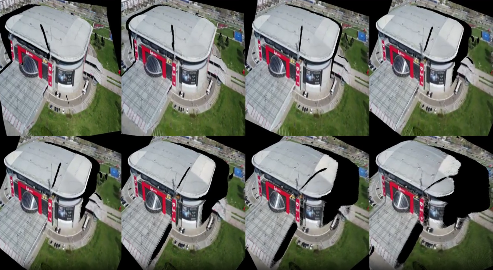
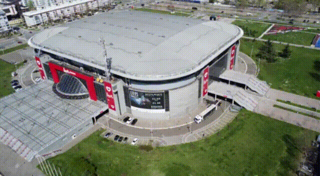

# GEN3C Multiple view support

## How is this different?

Multiview support through spatial maxpooling wasn't supported by authors in the codebase, so we have added it here for Cosmos backbone (check `cosmos_predict1/diffusion/model/model_gen3c.py`). Given that Cosmos uses spatiotemporal VAE, that means that downsampling to latent is not only done for frames, but also for time: $$( (T, H, W) -> (T / t_{down}, {H / h_down}, V / v_{down}))$$ so it is not possible to do exactly what is said in the paper (spatial maxpooling). But still, this works well enough for our initial example 

## Requirements

- [VGGT support (install before running this codebase)](https://github.com/facebookresearch/vggt) - for multiple view inference.

## Static multiple view support from video

In case you have a drone video of a scene, and you would like to use it to handle multiple view support for videos, we are providing exactly that!

<p align="center">
  
  <figcaption align="center">Figure 1: Multiview input before VAE.</figcaption>
</p>

<p align="center">
  
  <figcaption align="center">Figure 2: Output from Gen3C.</figcaption>
</p>

We have dummy video in [assets/multiview/bg_arena.mp4](assets/multiview/bg_arena.mp4) multiview.
Here we added [VGGT support](https://github.com/facebookresearch/vggt), where you are able to inference from multiple views on 
With `--frame_extraction_method first_max_frames` to obtain first 10 steps from the input video. If you want to increase step size, use `--step_size 10`.

```bash 
 CUDA_VISIBLE_DEVICES=0 CUDA_HOME=$CONDA_PREFIX PYTHONPATH=$(pwd) python cosmos_predict1/diffusion/inference/gen3c_batch_images.py     --checkpoint_dir checkpoints     --input_videos_dir assets/multiview/     --input_videos_pattern bg_arena.mp4     --output_images_dir results_from_batches     --save_as_video     --frame_extraction_method first_max_frames     --save_buffer     --frame_interval 1 --use_vggt --step_size 40 --foreground_masking --use_vggt

```

## Static multiple view support from images

In case you want multiple view support but from images, we provide that as well.
I.e. if you have an images folder `assets/multiview/` and pattern for images `input_images_*.png`, you can run the script below

```bash 
CUDA_VISIBLE_DEVICES=0 CUDA_HOME=$CONDA_PREFIX PYTHONPATH=$(pwd) python cosmos_predict1/diffusion/inference/gen3c_batch_images.py     --checkpoint_dir checkpoints     --input_images_dir assets/multiview/ --input_images_pattern input_image_*.png     --output_images_dir results_from_batches     --save_as_video     --frame_extraction_method first_max_frames     --save_buffer --use_vggt --step_size 40 --foreground_masking 
```
## Next steps

- [] Multiple input images support. This should support multiview 3D reconstruction, but from input images folder.

- [] Multiple input video support. This should support multiview 4D reconstruction.
